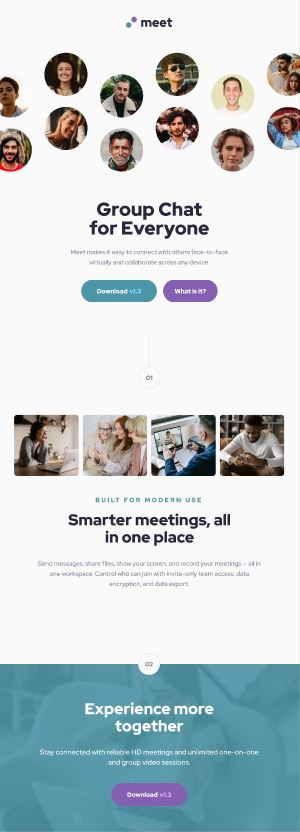
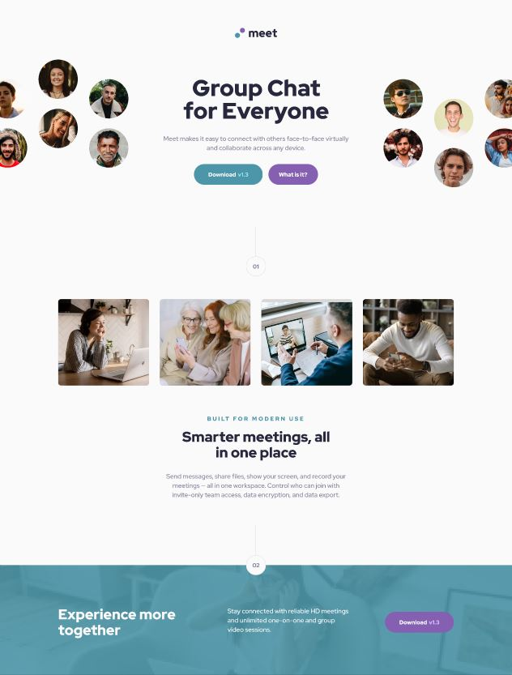

# Meet landing page solution

Design is from Frontend Mentor 

## Table of contents

- [Overview](#overview)
  - [The challenge](#the-challenge)
  - [Screenshot](#screenshot)
  - [Links](#links)
- [My process](#my-process)
  - [Built with](#built-with)
  - [What I learned](#what-i-learned)
  - [Useful resources](#useful-resources)
- [Author](#author)

## Overview

### The challenge

Users should be able to:

- View the optimal layout depending on their device's screen size
- See hover states for interactive elements

### Screenshot

Mobile Screenshot: 

Tablet Screenshot: 

Desktop Screenshot: 

### Links

- Solution URL: [https://www.frontendmentor.io/solutions/responsive-meet-landing-page-using-css-grid-and-flexbox-dPHolJJZx](https://www.frontendmentor.io/solutions/responsive-meet-landing-page-using-css-grid-and-flexbox-dPHolJJZx)
- Live Site URL: [https://fatimamushtaq29.github.io/meet-landing-page/](https://fatimamushtaq29.github.io/meet-landing-page/)

## My process

### Built with

- Semantic HTML5 markup
- Flexbox
- CSS Grid
- Mobile-first workflow
- SCSS

### What I learned

I used CSS Grid to position images and make them responsive. 

### Useful resources

- [Linearly Scale font-size with CSS clamp() Based on the Viewport](https://css-tricks.com/linearly-scale-font-size-with-css-clamp-based-on-the-viewport/) - This helped me understand clamp() property and how to linearly increase font-size, padding and margin.
- [Get your stylesheets more organized with Sass partials](https://www.youtube.com/watch?v=9Ld-aOKsEDk) - This is a youtube guide by Kevin Powell to get your stylesheets organized for better maintenance and scaling of your project.

## Author

- Github - [Fatima Mushtaq](https://github.com/fatimamushtaq29)
- Frontend Mentor - [fatimamushtaq29](https://www.frontendmentor.io/profile/fatimamushtaq29)
- LinkedIn - [Fatima Mushtaq](https://www.linkedin.com/in/fatima-mushtaq-2aa733107/)
